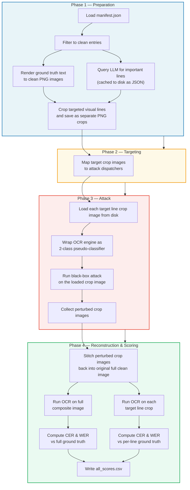
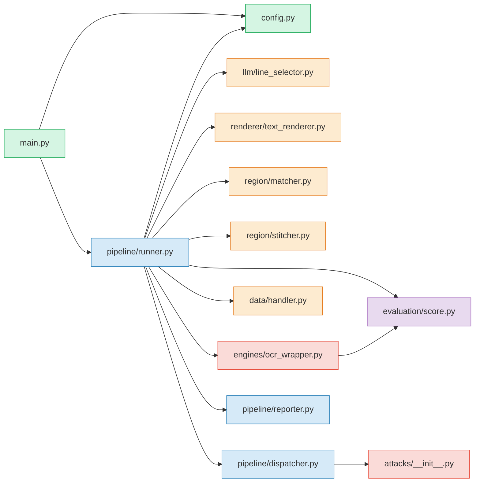
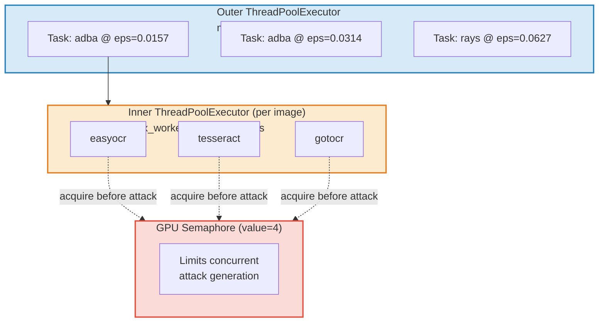

# AIRRI Adversarial Pipeline — Technical Reference

## Table of Contents

1. [Problem Statement](#1-problem-statement)
2. [Pipeline Overview](#2-pipeline-overview)
3. [Module Map](#3-module-map)
4. [Step-by-Step Pipeline Walkthrough](#4-step-by-step-pipeline-walkthrough)
   - 4.1 [Manifest Loading and Filtering](#41-manifest-loading-and-filtering)
   - 4.2 [LLM Line Selection](#42-llm-line-selection)
   - 4.3 [Text Rendering](#43-text-rendering)
   - 4.4 [Semantic-to-Visual Matching](#44-semantic-to-visual-matching)
   - 4.5 [Line Cropping and Attack Execution](#45-line-cropping-and-attack-execution)
   - 4.6 [Stitching](#46-stitching)
   - 4.7 [Evaluation and Scoring](#47-evaluation-and-scoring)
5. [OCR Wrapper: Turning OCR into a Classifier](#5-ocr-wrapper-turning-ocr-into-a-classifier)
6. [Attack Registry and Dispatch](#6-attack-registry-and-dispatch)
7. [Concurrency Model](#7-concurrency-model)
8. [Scoring Functions](#8-scoring-functions)
9. [Configuration Reference](#9-configuration-reference)
10. [Output Directory Layout](#10-output-directory-layout)

---

## 1. Problem Statement

Standard adversarial attacks perturb every pixel of an image. This is wasteful for document images. A document has many lines of text, but only a few lines carry the actual assignment instructions. Perturbing the entire page wastes attack budget on irrelevant headers, due dates, and course logistics.

This pipeline takes a different approach: it asks an LLM to identify which lines in a document actually matter, crops just those lines out of the rendered image, runs adversarial attacks on the small crops, and pastes the perturbed crops back into the original clean image. The result is a document that looks nearly identical to the original but where the important lines have been subtly altered to fool OCR engines.

---

## 2. Pipeline Overview

The pipeline runs in a fixed sequence of steps for each dataset. Here is the full flow:



---

## 3. Module Map

Each box below is a Python module in the `adversarial/` directory. Arrows show import dependencies.



| Module | File | Purpose |
|:---|:---|:---|
| Entry point | `main.py` | Creates `PipelineConfig`, creates `AdversarialPipeline`, calls `pipeline.run()` |
| Config | `config.py` | Dataclass holding all pipeline settings (attacks, engines, epsilons, rendering params) |
| Runner | `pipeline/runner.py` | Orchestrates the full pipeline: loading, rendering, attacking, stitching, scoring |
| Dispatcher | `pipeline/dispatcher.py` | Maps each attack name to its specific function signature |
| Reporter | `pipeline/reporter.py` | Buffers per-image score rows in memory, writes them to CSV at the end |
| LLM Selector | `llm/line_selector.py` | Calls the Hugging Face Inference API to select important text excerpts |
| Renderer | `renderer/text_renderer.py` | Draws text onto images using PIL, records bounding boxes for each visual line |
| Matcher | `region/matcher.py` | Maps LLM-selected text excerpts to visual line bounding boxes |
| Detector | `region/detector.py` | Detects text lines in images using horizontal projection profiles |
| Stitcher | `region/stitcher.py` | Pastes perturbed crops back into the clean image at their bounding boxes |
| OCR Wrapper | `engines/ocr_wrapper.py` | Wraps OCR engines as 2-class classifiers for use with attack libraries |
| Data Handler | `data/handler.py` | Loads manifests, converts images to DataLoaders, saves output images |
| Scoring | `evaluation/score.py` | Computes character-level and word-level accuracy using Levenshtein distance |
| Attack Registry | `attacks/__init__.py` | Lazy-loads attack wrapper classes by name (SMOO, ADBA, RayS, SurFree, L0-PGD) |

---

## 4. Step-by-Step Pipeline Walkthrough

### 4.1 Manifest Loading and Filtering

**Source**: `data/handler.py` — `load_manifest()` and `filter_clean_manifest()`

The pipeline reads a JSON manifest file. Each entry has two required fields:

```json
[
  {
    "image_name": "1_clean.png",
    "ground_truth": "The full text content of the document..."
  }
]
```

The function `filter_clean_manifest()` keeps only entries where `image_name` contains the substring `"clean"` (case-insensitive). This separates baseline images from any pre-existing adversarial variants in the dataset.

---

### 4.2 LLM Line Selection

**Source**: `llm/line_selector.py` — `LLMLineSelector.select_important_lines()`

For each manifest entry, the pipeline sends the `ground_truth` text to a language model (default: `google/gemma-4-31B-it:fastest` via the Hugging Face Inference API) and asks it to return the verbatim lines that an LLM would need in order to complete the assignment.

**What the prompt tells the LLM to select:**
- What the student is being asked to do
- What topic or problem must be addressed
- What deliverables are required
- What constraints apply (format, length, citation style, etc.)
- What evaluation criteria define success

**What the prompt tells the LLM to ignore:**
- Course logistics, submission procedures, due dates
- Instructor contact information
- Generic academic integrity statements

The prompt explicitly states: *"The lines DO NOT need to be consecutive. They may come from completely different parts of the document."*

The LLM returns a JSON array of verbatim string excerpts. Each returned excerpt is validated:

1. **Exact match**: Check if the excerpt appears as a substring of the ground truth.
2. **Fuzzy match**: If exact match fails, normalize both strings by removing all whitespace, then try substring matching. If a match is found, the original (non-normalized) text from the ground truth is used.
3. **Fallback**: If the API call fails after `max_retries` attempts (with exponential backoff: delay × 2^attempt), or if the response contains no valid excerpts, the selector returns every non-empty line of the ground truth. This guarantees the pipeline always has something to work with.

**Caching**: Selections are saved to disk as JSON files in `<output_dir>/<dataset>/llm_selections/<image_stem>.json`. On subsequent runs, cached results are loaded instead of re-querying the API.

---

### 4.3 Text Rendering

**Source**: `renderer/text_renderer.py` — `TextRenderer.render()`

The pipeline does not use the original dataset images. Instead, it renders the ground truth text into clean images from scratch. This gives the pipeline exact control over font, layout, and — most importantly — the precise pixel coordinates of every line.

**Rendering process:**

1. The text is word-wrapped using Python's `textwrap.wrap()` at a configurable column width (default: 90 characters).
2. A dummy 1×1 image is created to measure each wrapped line's pixel dimensions using `ImageDraw.textbbox()`.
3. The final image dimensions are computed:
   - Width = widest line + left margin + right margin
   - Height = top margin + sum of (line heights + padding between lines) + bottom margin
4. A white RGB image of those dimensions is created.
5. Each line is drawn at its computed position using `ImageDraw.text()`.
6. After drawing, `textbbox()` is called again at the actual draw position to get a tight bounding box.

The result is a `RenderedImage` object containing:
- The PIL image
- A list of `RenderedLine` objects, each with: the line text, its bounding box `(x1, y1, x2, y2)`, and its index (0-based)
- The full original text
- The image filename

The font resolution tries a preference list of monospace fonts (`DejaVuSansMono`, `LiberationMono`, `NimbusMonoPS`, `DejaVuSans`) and falls back to PIL's built-in bitmap font if none are available.

---

### 4.4 Semantic-to-Visual Matching

**Source**: `region/matcher.py` — `match_semantic_to_visual()`

This function answers the question: "Given that the LLM selected these text excerpts, which bounding boxes in the rendered image do they correspond to?"

The matching works by character offsets in the full text:

**Step 1 — Build a character-offset map for each visual line:**

For each `RenderedLine`, find where its text starts and ends within `full_text`:

```
full_text: "Line one. Line two. Line three."
            ↑         ↑          ↑
            0         10         20

Visual line 0: chars  0..9   → bbox (15, 16, 200, 28)
Visual line 1: chars 10..19  → bbox (15, 33, 200, 45)
Visual line 2: chars 20..31  → bbox (15, 50, 200, 62)
```

The search is sequential: each line's start position is found by calling `full_text.find(line.text, previous_end)`. This handles repeated substrings correctly because the search always starts after the previous line ended.

**Step 2 — For each LLM excerpt, find overlapping visual lines:**

The excerpt's position in `full_text` is located (with a fuzzy fallback that normalizes whitespace). Two intervals overlap when:

```
max(line_start, excerpt_start) < min(line_end, excerpt_end)
```

All visual lines satisfying this condition are collected into a `MatchedRegion`.

**Step 3 — Compute the union bounding box:**

```
x1 = min of all matched lines' x1
y1 = min of all matched lines' y1
x2 = max of all matched lines' x2
y2 = max of all matched lines' y2
```

This handles excerpts that span multiple visual lines (because `textwrap` broke a long sentence across lines).

**Fallback**: If matching produces zero regions, the runner falls back to targeting every visual line in the image.

---

### 4.5 Line Cropping and Attack Execution

**Source**: `pipeline/runner.py` — `_process_engine()`

For each matched region, the pipeline iterates over its visual lines and processes each one individually. A `processed_line_indices` set prevents the same visual line from being attacked twice (which can happen when multiple LLM excerpts overlap the same visual line).

For each visual line:

1. **Load Crop**: Instead of dynamic in-memory cropping, the pipeline loads the standalone line crop image file from the disk location:
   `<ds_output_dir>/clean_renders/crops/<image_stem>/line_{vl.line_index:02d}.png`
2. **Convert to DataLoader**: The crop image is loaded and converted to a float32 tensor in `[0, 1]` range with shape `(1, 3, H, W)` and wrapped in a PyTorch `DataLoader` with a label of `1` (meaning "correctly read").
3. **Create OCR wrapper**: An `OCRModelWrapper` is created for this specific line, with the line's text as its ground truth.
4. **Run attack**: The attack function is called through `dispatch_attack()`, which handles the different argument conventions of each attack. The attack returns a `DataLoader` containing the perturbed image.
5. **Extract result**: The first (and only) image is extracted from the returned DataLoader, converted from `(C, H, W)` tensor back to `(H, W, 3)` numpy array, and clipped to `[0, 1]`.

The attack execution is gated by a `gpu_semaphore` (see [Section 7](#7-concurrency-model)).

If the attack raises an exception for a particular line, that line is skipped and the clean pixels are preserved.

---

### 4.6 Stitching

**Source**: `region/stitcher.py` — `stitch_adversarial()` and `stitch_multi_region()`

After all target lines have been attacked, the perturbed crops are pasted back into the clean image.

**The rule is simple**: for each perturbed crop and its bounding box, copy the crop's pixels into the corresponding region of the clean image. Everything outside the bounding boxes stays exactly as it was.

```
composite[y1:y2, x1:x2, :] = perturbed_crop
```

Coordinates are clamped to image bounds. The crop dimensions must match the bounding box dimensions exactly — if they don't, a `ValueError` is raised.

For multiple crops, `stitch_multi_region()` applies them sequentially. Since text lines in single-column documents do not overlap, the order does not matter.

The final composite is saved as a PNG to `<attack>/<eps>/<engine>/composite_images/`. Individual perturbed line crops are also saved separately to `line_crops/` for debugging.

---

### 4.7 Evaluation and Scoring

**Source**: `pipeline/runner.py` — inside `_process_engine()`, and `pipeline/reporter.py`

After stitching, the pipeline evaluates the composite image at two levels:

**Level 1 — Full composite evaluation:**
- OCR is run on the entire composite image.
- The extracted text is compared against the full ground truth text.
- CER and WER are computed and recorded with `eval_scope="full_composite"`.

**Level 2 — Per-line target evaluation:**
- For each attacked line, the pipeline crops that line's bounding box from the composite image.
- OCR is run on just that crop.
- The extracted text is compared against that specific line's ground truth text.
- CER and WER are computed and recorded with `eval_scope="target_region"`.

The OCR text extraction works by writing the image to a temp directory, calling the engine function, and reading the resulting `.txt` file.

All score rows are buffered in memory by `PipelineReporter` and flushed to `all_scores.csv` at the end of the pipeline run.

---

## 5. OCR Wrapper: Turning OCR into a Classifier

**Source**: `engines/ocr_wrapper.py` — `OCRModelWrapper`

Adversarial attack libraries expect a model that takes an image tensor and returns class logits. OCR engines don't work that way — they take an image and return text. The `OCRModelWrapper` bridges this gap by turning OCR into a 2-class classification problem:

```
Class 0: "misread"  — OCR accuracy is below the threshold
Class 1: "correct"  — OCR accuracy is at or above the threshold
```

**How it works:**

When the attack calls `model(image_tensor)`:

1. The tensor (shape `(N, C, H, W)`, float `[0, 1]`) is converted to a PIL image.
2. The PIL image is saved to disk, and the OCR engine is invoked via `ENGINE_FNS[engine_name]`.
3. The OCR output text is compared to the stored ground truth using `evaluate_text_pair()` to get an accuracy percentage.
4. If accuracy ≥ threshold → return `[[0.0, 1.0]]` (predict class 1: correct)
5. If accuracy < threshold → return `[[1.0, 0.0]]` (predict class 0: misread)

The attack's job is to flip the prediction from class 1 to class 0. Each call to `model(image_tensor)` counts as one query.

**Dynamic threshold adjustment**: On the first query (the clean image), if the OCR engine already reads the line poorly (accuracy below `cer_threshold`), the wrapper lowers its target. Specifically, it sets the threshold to the lesser of `(accuracy - 10)` and `(accuracy × 0.8)`, floored at 0. This prevents the attack from "succeeding" without actually doing anything.

**Disk I/O optimization**: Because attacks may issue hundreds of queries per line, the wrapper creates its temp directory on `/dev/shm` (Linux RAM disk) if available. This avoids SSD write bottlenecks during query-heavy attacks.

The supported OCR engines are loaded from `evaluation/engines/` using `importlib`:

| Engine key | Function | Source file |
|:---|:---|:---|
| `easyocr` | `run_easyocr_folder` | `evaluation/engines/easyocr_engine.py` |
| `tesseract` | `run_tesseract_folder` | `evaluation/engines/tesseract_engine.py` |
| `gotocr` | `run_gotocr_folder` | `evaluation/engines/gotocr_engine.py` |
| `trocr` | `run_trocr_folder` | `evaluation/engines/trocr_engine.py` |

---

## 6. Attack Registry and Dispatch

**Source**: `attacks/__init__.py` and `pipeline/dispatcher.py`

Attacks are registered in `ATTACK_REGISTRY`, a dictionary mapping string names to lazy-loading functions. The lazy loading means attack dependencies are only imported when that attack is actually used:

```python
ATTACK_REGISTRY = {
    "smoo":         _lazy_smoo,        # → SMOO_AttackWrapper
    "adba":         _lazy_adba,        # → ADBA_AttackWrapper
    "surfree":      _lazy_surfree,     # → SurFree_AttackWrapper
    "rays":         _lazy_rays,        # → RaySAttack
    "l0_pgd":       _lazy_l0_pgd,      # → L0_PGD_AttackWrapper
    "l0_sigma_pgd": _lazy_l0_sigma_pgd,# → L0_Sigma_PGD_AttackWrapper
    "l0_linf_pgd":  _lazy_l0_linf_pgd, # → L0_Linf_PGD_AttackWrapper
}
```

Each attack has a different calling convention. The `dispatch_attack()` function translates the pipeline's uniform `(attack_name, eps, config_overrides)` interface into the specific arguments each attack expects:

| Attack | Epsilon meaning | Key config fields |
|:---|:---|:---|
| `smoo` | Pixel-level perturbation limit (converted to int if ≥ 1, else `int(eps × 1024)`) | `iterations`, `pc`, `pm`, `pop_size`, `seed` |
| `adba` | L∞ perturbation budget (passed as `epsilon`) | `budget`, `init_dir`, `offspring_n`, `binary_mode` |
| `rays` | L∞ perturbation budget (passed directly) | `query_limit` |
| `surfree` | L2 distance threshold (passed as `l2_threshold`) | `init.steps`, `init.max_queries` |
| `l0_pgd` variants | Sparsity (converted to int if ≥ 1, else `int(eps × 1024)`) | `n_restarts`, `num_steps`, `step_size`, `random_start` |

SurFree returns a tuple `(advLoader, adv_blobs)` — the dispatcher extracts just the loader.

---

## 7. Concurrency Model

**Source**: `pipeline/runner.py` — `_run_dataset()` and `_run_attack_config()`

The pipeline uses two levels of thread pools and one semaphore:



**Outer pool**: One thread per `(attack_name, epsilon)` combination. For example, with 4 attacks and 3 epsilon values each, there are 12 tasks. The pool is sized to `min(16, num_tasks)`.

**Inner pool**: For each image within an attack config, one thread per OCR engine. This runs different engines on the same image concurrently.

**GPU semaphore**: A `threading.Semaphore` with a default value of 4. Each thread must acquire the semaphore before running `dispatch_attack()` and releases it afterward. This prevents more than 4 GPU-heavy operations from running simultaneously, avoiding CUDA out-of-memory errors.

The semaphore only gates the attack generation step. OCR evaluation, stitching, and file I/O happen outside the semaphore.

---

## 8. Scoring Functions

**Source**: `evaluation/score.py`

### Character-Level Accuracy (CER-based)

`evaluate_text_pair(predicted, ground_truth)`:

1. Both strings are normalized: all whitespace is removed, and text is lowercased.
2. The Levenshtein edit distance between the normalized strings is computed. This counts the minimum number of single-character insertions, deletions, and substitutions needed to transform one string into the other.
3. Accuracy is calculated as:

```
accuracy = max(0, (1 - edit_distance / length_of_ground_truth)) × 100
```

If the ground truth is empty: returns 100 if predicted is also empty, otherwise 0.

### Word-Level Accuracy (WER-based)

`evaluate_text_pair_wer(predicted, ground_truth)`:

1. Both strings are tokenized into word lists by splitting on whitespace, then lowercased.
2. The Levenshtein distance is computed over the word lists (treating each word as a unit).
3. Accuracy is calculated as:

```
accuracy = max(0, (1 - edit_distance / number_of_ground_truth_words)) × 100
```

Both functions return a percentage in the range `[0, 100]`.

---

## 9. Configuration Reference

**Source**: `config.py` — `PipelineConfig`

| Field | Type | Default | Description |
|:---|:---|:---|:---|
| `attacks` | `list[str]` | `["smoo", "adba", "rays", "surfree"]` | Which attacks to run |
| `attack_eps` | `dict` | See below | Epsilon values per attack |
| `attack_configs` | `dict` | See below | Hyperparameters per attack |
| `engines` | `list[str]` | `["easyocr", "tesseract", "gotocr", "trocr"]` | Which OCR engines to target |
| `cer_threshold` | `float` | `50.0` | Accuracy boundary for the OCR wrapper's class decision |
| `dataset_root` | `Path` | `<repo>/dataset/` | Base path for dataset directories |
| `datasets` | `list[dict]` | UCONN + 8and12 | Dataset entries with `name` and `manifest` path |
| `output_dir` | `Path` | `adversarial/output/` | Where all output files are written |
| `llm_model` | `str` | `"google/gemma-4-31B-it:fastest"` | Hugging Face model for line selection |
| `llm_max_retries` | `int` | `3` | Max API retries before falling back to all lines |
| `render_font_path` | `str or None` | `None` | Override font path (None uses system defaults) |
| `render_font_size` | `int` | `12` | Font size in points |
| `render_wrap_width` | `int` | `90` | Character column width for word wrapping |
| `render_margin_x` | `int` | `15` | Left and right margin in pixels |
| `render_margin_top` | `int` | `16` | Top margin in pixels |
| `render_margin_bottom` | `int` | `17` | Bottom margin in pixels |
| `render_line_padding` | `int` | `5` | Vertical gap between lines in pixels |
| `render_bg_color` | `str` | `"white"` | Background color |
| `render_text_color` | `str` | `"black"` | Text color |
| `stitch_mode` | `str` | `"hard"` | Stitching method (hard-mask copy) |
| `eval_mode` | `str` | `"both"` | Score both full composite and per-line crops |

**Default epsilon values:**

| Attack | Epsilon values |
|:---|:---|
| `adba` | `4/255`, `8/255`, `16/255` |
| `rays` | `4/255`, `8/255`, `16/255` |
| `surfree` | `2`, `3`, `5` |
| `smoo` | `10`, `20` |

**Default attack hyperparameters:**

| Attack | Parameters |
|:---|:---|
| `smoo` | `iterations=500`, `pc=0.80`, `pm=0.20`, `pop_size=10`, `seed=42` |
| `adba` | `budget=10000`, `init_dir=1`, `offspring_n=10`, `binary_mode=0` |
| `rays` | `query_limit=10000` |
| `surfree` | `init.steps=200`, `init.max_queries=10000` |

---

## 10. Output Directory Layout

```
adversarial/output/
├── <dataset_name>/
│   ├── clean_renders/
│   │   ├── <image_name>.png           ← rendered clean full-page image
│   │   └── crops/
│   │       └── <image_stem>/
│   │           └── line_00.png        ← standalone clean line crop image file
│   │
│   ├── llm_selections/
│   │   └── <image_stem>.json          ← cached LLM-selected excerpts
│   │
│   └── <attack_name>/
│       └── eps_<value>/
│           └── <engine_name>/
│               ├── composite_images/
│               │   └── <image_name>.png   ← full stitched result
│               │
│               ├── line_crops/
│               │   └── <stem>_line_00.png ← individual perturbed crops
│               │
│               ├── results_full/
│               │   └── <stem>.txt         ← OCR output on full composite
│               │
│               └── results_target/
│                   └── <stem>_line_00.txt  ← OCR output on target line crop
│
├── logs/
│   └── adversarial_pipeline.log
│
└── all_scores.csv
```

**CSV columns** (from `PipelineReporter`):

| Column | Description |
|:---|:---|
| `image_name` | Source image filename |
| `engine` | OCR engine used |
| `eps` | Perturbation budget |
| `attack` | Attack name |
| `eval_scope` | `"full_composite"` or `"target_region"` |
| `target_line` | `"all"` for full composite, or the line's text for target region |
| `cer` | Character-level accuracy (0–100, rounded to 4 decimal places) |
| `wer` | Word-level accuracy (0–100, rounded to 4 decimal places) |
